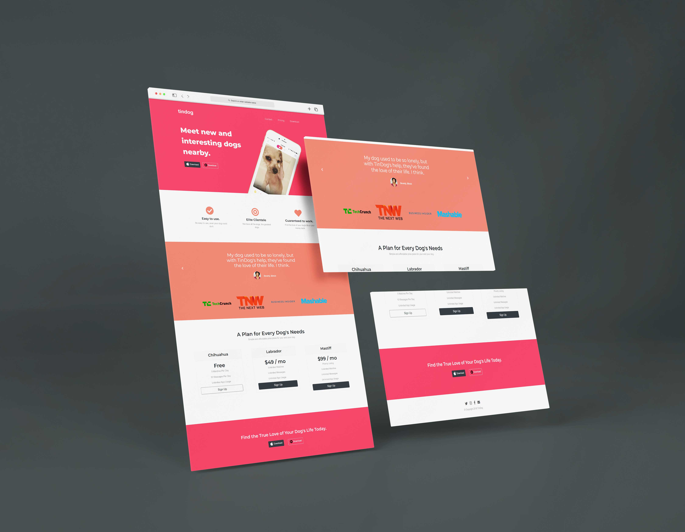
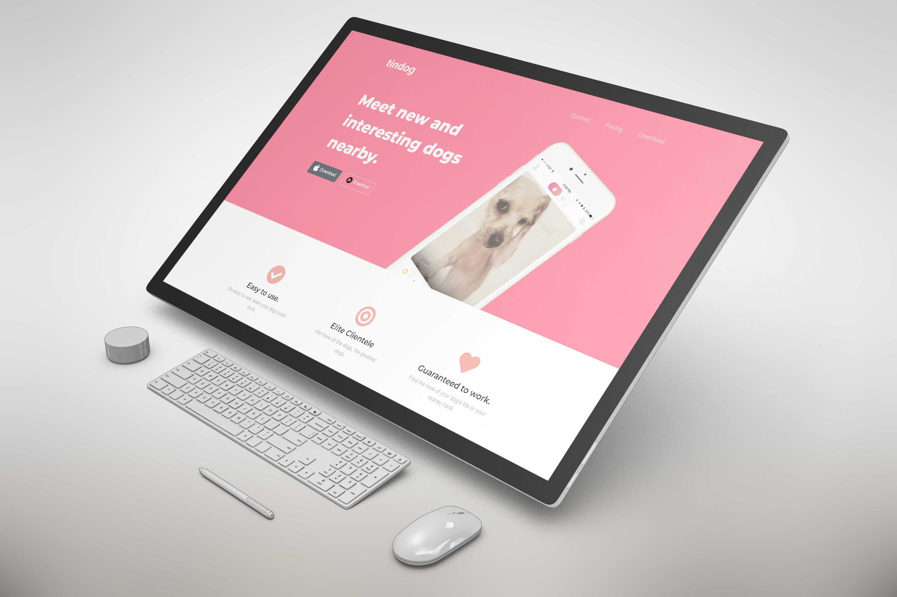
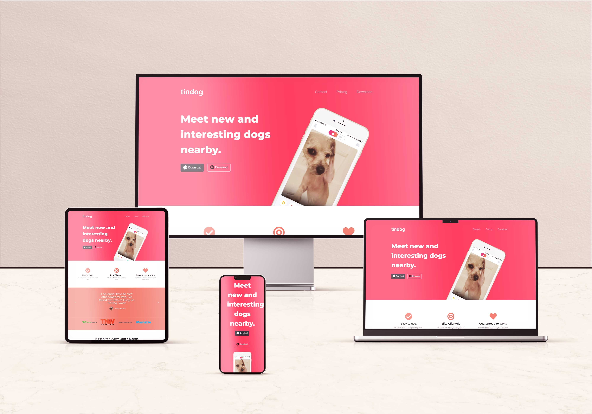

# Tindog clone 

It's no secret that owning a dog can add years to your life. Dogs offer companionship, reduce stress levels, and promote physical activity.

## Deployed link of project
- <a href="https://lively-truffle-927c85.netlify.app/">tindog.com </a> (clone)

## Team Members

<ul>
  <li><a href="https://github.com/pratiksontakke">Pratik Sontakke</a> (solo project)</li>
</ul>


## Deployment

On frontend terminal perform:

```bash
  Open index.html with live server
```


## 🛠 Tech Stack

- Boothstrap
- Material UI
- Javascript
- HTML
- CSS
- Local storage

## Functionality

- Navbar working
- Responsive for all devices
- Testimonial Slider

## Website flow for User

- Navbar

- Banner

- Feature Section

- Testimonial section

- E-commerce section

- Footer


#### Website Presentation :






## Thank you note
Thank you all who is giving precious time to visit our little creative project which is made with lot of efforts.

_<p align="center"><sub>- Designed by <a href="https://github.com/pratiksontakke">Pratik Sontakke</a> -</sub></p>_